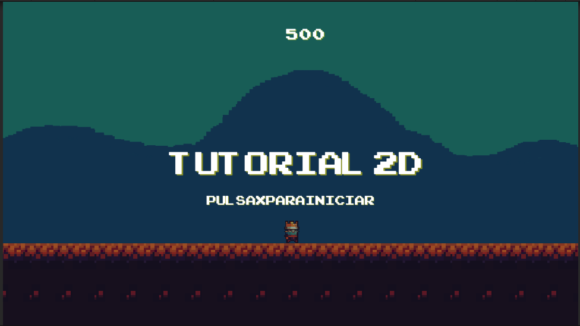
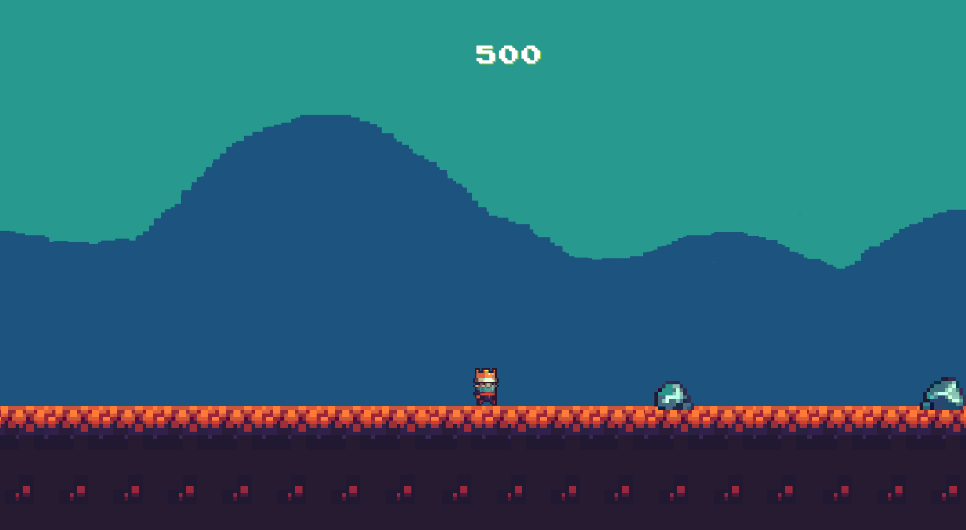
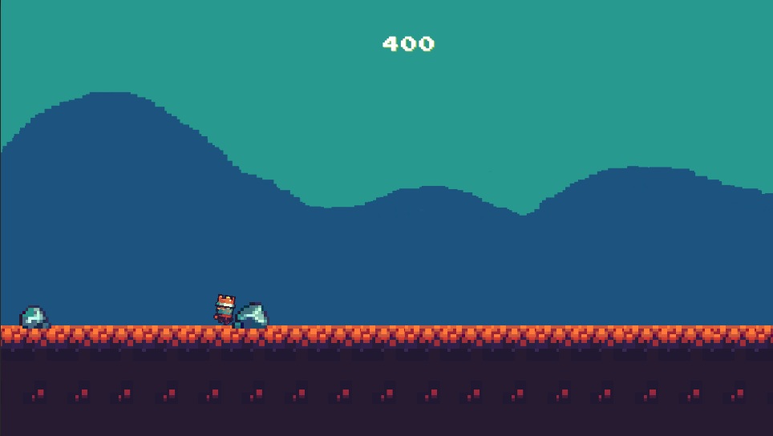
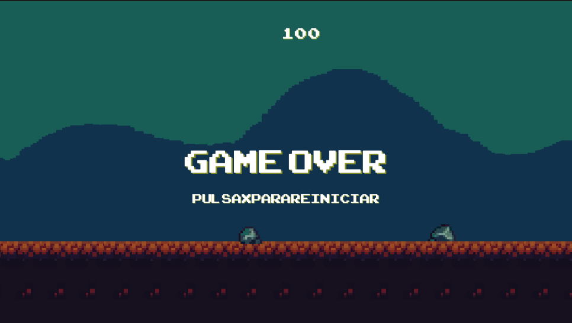

# MyFirstVideogame-Unity

Descripción breve del proyecto.

## Idea del Juego
La idea central del videojuego desarrollado radica en la supervivencia y evasión, a través de una mecánica de juego intuitiva pero desafiante. El título está diseñado en un formato 2D con un personaje principal que representa a un rey. Este rey tiene la capacidad de moverse por la pantalla y saltar obstáculos que se presentan a lo largo de su camino. El objetivo del juego es navegar a través de estos obstáculos y mantener la puntuación del rey durante el mayor tiempo posible.

## Propuesta de Juego
La propuesta de este juego se centra en proporcionar una experiencia de juego que desafíe la habilidad y los reflejos del jugador, a la vez que incentive la mejora continua y la repetición. El jugador se enfrenta al reto de mantener al personaje principal, el rey, vivo al saltar obstáculos que aparecen en su camino. Cada obstáculo es tanto un desafío como una oportunidad de aprendizaje. El juego combina desafío, habilidad, reflejos y una fuerte sensación de repetición y mejora para ofrecer una experiencia de juego atractiva y gratificante.

## Capturas de Pantalla

*Imagen 1. Inicio del Juego*

*Imagen 2. Estado del jugador "correr"*

*Imagen 3. Colisión del jugador con el obstáculo*

*Imagen 4. Fin del juego*

## Cómo usar el proyecto

1. Clona o descarga el proyecto en tu computadora.
2. Abre Unity y selecciona "Open Project".
3. Navega hasta la carpeta del proyecto y selecciona la carpeta principal.
4. Espera a que Unity importe todos los assets y configuraciones del proyecto.
5. Una vez importado, selecciona la escena principal del juego.
6. Haz clic en el botón de reproducción para iniciar el juego.

## Referencia del Tutorial

Este proyecto está basado en el tutorial "Crea tu primer juego 2D en Unity desde cero" del canal de YouTube "Antony Morsas". Puedes encontrar el tutorial [aquí](https://www.youtube.com/watch?v=4XvfpCz_vh8&t=3949s).

